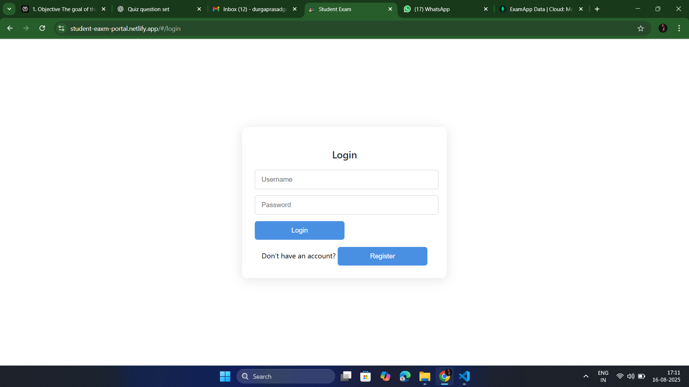
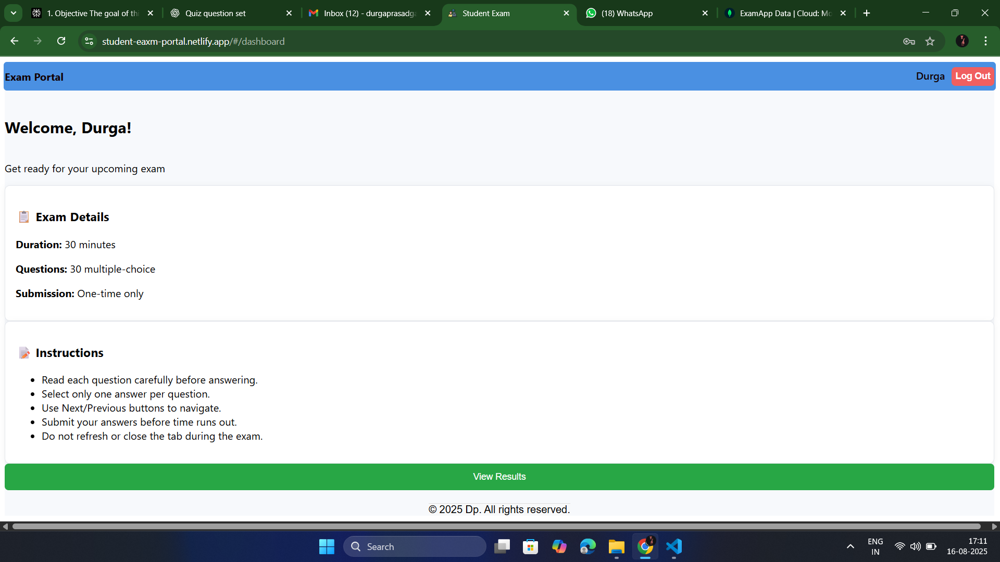
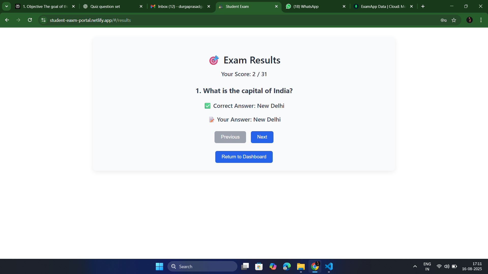

# Student Exam Builder ACE

A full-stack web application for building and managing online exams.  
This project has two parts:  

- **Frontend** → React (deployed on **Netlify**)  
- **Backend** → Node.js + Express + MongoDB (deployed on **Render**)  

||||||||

## 🚀 Project Setup & Deployment

### 1. Clone the Repository
git clone <your-repo-link>
cd new-exam-builder-ace-main
2. Backend Setup (Node.js + Express + MongoDB)
Step 1: Go to backend folder

cd backend
Step 2: Install dependencies

npm install
Step 3: Create .env file inside backend
env

PORT=5000
MONGO_URI=your-mongodb-uri
JWT_SECRET=your-secret-key
Step 4: Run backend locally

npm start
Backend will run at:
👉 http://localhost:5000

Step 5: Deploy backend on Render
Push code to GitHub.

Go to Render.

Create New Web Service → Connect your GitHub repo.

https://github.com/Durgaprasadgalla/Student_Portal_Backend

Set build command:

npm install

Start command:

npm start

Add environment variables (MONGO_URI, JWT_SECRET, etc.) in Render settings.

Deploy and get your Render backend URL (e.g., https://student-portal-backend.onrender.com).

3. Frontend Setup (React)
Step 1: Go to frontend folder

cd ../frontend
Step 2: Install dependencies

npm install
Step 3: Configure API base URL
Inside your frontend project, find where the backend API URL is used (e.g., src/api.js or .env) and replace with your Render backend URL:

.env

REACT_APP_API_URL=https://student-portal-backend-xf7y.onrender.com

Step 4: Run frontend locally

npm start
Frontend will run at:
👉 http://localhost:3000

Step 5: Deploy frontend on Netlify
Run build command:

npm run build
Go to Netlify.

Click New Site from Git or drag and drop the build folder.

Set build command:

arduino

npm run build
Publish directory:

build
Deploy and get your Netlify frontend URL (e.g., https://student-exam-portal.netlify.app).

🔗 Final Setup
Frontend (Netlify) → http://student-eaxm-portal.netlify.app/

Backend (Render) → https://student-portal-backend-xf7y.onrender.com

Make sure frontend API calls point to the Render backend URL.

🛠️ Tech Stack
Frontend → React, Tailwind/Bootstrap (if used), Axios/Fetch

Backend → Node.js, Express.js, MongoDB

Deployment → Netlify (Frontend), Render (Backend)

||||||||||||

🚀API Testing with Postman

GET Users

Method: GET  
URL: https://student-portal-backend-xf7y.onrender.com/api/users

POST User (Register)

Method: POST  

URL: https://student-portal-backend-xf7y.onrender.com/api/

Body (JSON):

{

  "username": "john",

  "password": "John@123"

}

DELETE User

Method: DELETE  

URL: https://student-portal-backend-xf7y.onrender.com/api/users/<userId>

FINAL LIVE LINK:  http://student-eaxm-portal.netlify.app/

## Screenshots  

### Home Page  

### Dashboard  

### Exam Page  

👨‍💻 Author
Developed by Galla Durga Prasad
